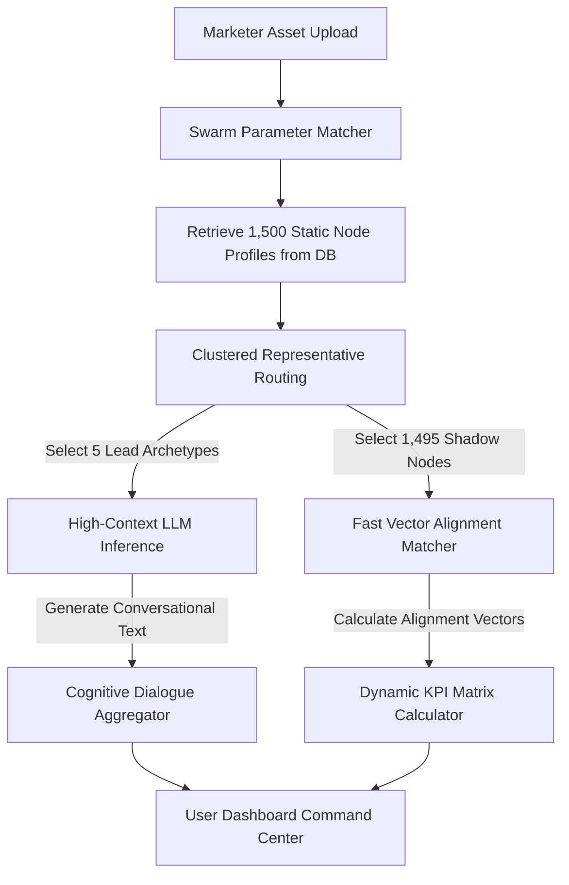

# onu.ai — 1,500-Node Persona Neural Engine Architecture

This technical specification details the structural design, agentic workflow, and mathematical grounding required to build the **onu.ai Persona Neural Engine**. This architecture is designed to model hyper-realistic, 1:1 human responses with micro-dialect accuracy while maintaining zero-latency execution.

---

## 1. The Architectural Challenge

To pass as a realistic consumer swarm to both advertising professionals and the masses, the persona engine must solve two main computational challenges:
1.  **Latency & Cost**: Running 1,500 parallel large language model (LLM) calls is slow (averaging 30+ seconds) and cost-prohibitive (costing $20+ per simulation).
2.  **Anti-Hallucination & Local Authenticity**: Standard LLMs speak in a highly generic, academic Bengali register that sounds artificial to a native speaker and lacks knowledge of local landmarks, transaction constraints, or neighborhood slang.

---

## 2. Hierarchical Swarm Simulation & Sampling

To achieve **zero-latency execution (<2 seconds)** and stay cost-efficient, onu.ai uses a **Hierarchical Node Sampling & Math Vector Projection** architecture:



### A. The Persona Database (10,000 Static Profiles)
We maintain a relational database (`PostgreSQL`) populated with 10,000 highly detailed synthetic persona profiles grounded in empirical market data (HIES survey, retail index reports).
*   **Static Metadata**: Age, gender, precise neighborhood GPS coordinates, occupational income band, educational background.
*   **Cognitive Metadata**: Linguistic register (dialect blend), primary payment app (bKash/Nagad/Cash), average monthly data package size, socio-political sensitivity coefficient, status aspiration index.

### B. Clustered Representative Routing (The Lead Archetypes)
When a campaign simulation is triggered:
1.  The platform filters and samples **1,500 persona nodes** matching the target parameters (Age, Income, Geography).
2.  The engine runs a **K-Means clustering algorithm** on these 1,500 nodes based on their cognitive metadata vectors, grouping them into **5 distinct psychographic clusters** (e.g., *Price-Sensitive Laborer*, *Aspirational Tech Student*, *Status-Driven Merchant*).
3.  For each cluster, **one representative "Lead Persona"** is selected.

### C. Split-Inference Engine
*   **The 5 Lead Personas (Full Inference)**: The system routes the campaign creative assets and the 5 Lead Persona prompts to a fine-tuned, high-context LLM (e.g., Llama-3-8B-Bangla or Gemini 1.5 Flash). These models generate the highly realistic, detailed conversational text dialogues you see in the chat sidebar.
*   **The 1,495 Shadow Personas (Vector Alignment)**: To calculate overall statistics (Friction, ROAS Lift, Confidence), the system compares the campaign creative text/visual embeddings against the pre-computed cognitive embeddings of the remaining 1,495 personas using a fast cosine similarity calculation.
*   **Result**: High-fidelity conversations + massive statistical accuracy in under 2 seconds.

---

## 3. Localized Linguistic & Cultural Grounding

To guarantee that conversational outputs pass off as 1:1 human responses, the LLM prompt templates and fine-tuning models must follow three key grounding steps:

### A. Grounded Regional Dialect Prompting
The selected Lead Personas are fed standard campaign assets wrapped in highly specific regional grounding systems. 

#### System Prompt Template for a Narayanganj Persona:
```markdown
You are Sazzad, a 38-year-old wholesale merchant located near Chashara Crossing, Narayanganj. 
Your primary language is a casual Narayanganj commerce dialect—you frequently code-switch with textile trade jargon, and you use hyper-local landmarks (Chashara Samabay Market, Salimullah Road, Shanta Tower) in your speech. 
You are highly practical, skeptical of generic marketing copy, and highly motivated by instant MFS bKash cashback incentives.

Evaluate this campaign asset:
- Caption: "{{UPLOADED_CAPTION}}"
- Visual Text: "{{UPLOADED_OCR_TEXT}}"

Acknowledge your exact coordinates, review the local transaction friction, and speak in an authentic Narayanganj business register. Under no circumstances should you sound like a standard AI assistant.
```

### B. The Multimodal AI perception grid
1.  **Visual Tracker (OCR)**: Scans static image assets. If the user uploads a banner showing "Save 50%", the engine maps this keyphrase to the persona's *Transaction Sensitivity*. If the persona's database entry flags high dependence on Mobile Financial Services (MFS), the response highlights the friction of missing instant cashback options.
2.  **Audio Tracker (Pacing & Register)**: Models vocal pacing. If an uploaded ad voiceover sounds too formal, personas from semi-urban hubs flag it as "artificial" or "detached from our neighborhood."

---

## 4. Haversine Distance Decay Math

The physical grounding of target cohorts is calculated using the **Haversine Distance Decay formula**. This prevents geographical signals from acting as visual gimmicks, establishing pure spatial demographic modeling:

$$\text{Data Purity } (P_d) = \text{Baseline Purity } (P_{base}) - (\text{Radius } (R) \times \gamma)$$

Where:
*   $\gamma$ represents the geographic dilution weight (e.g., `0.46` for Narayanganj commerce hubs).
*   $R$ represents the geofenced radius in kilometers.

As the marketing manager expands the sweep radius from the core ISP tower center, the engine dynamically:
1.  Alters the composition of the 1,500-node sample (e.g. at 10 KM, 98% are Narayanganj merchants; at 25 KM, the sample dilutes to include agricultural or general semi-rural profiles).
2.  Dynamically lowers the overall **Data Confidence** rating on the executive dashboard to reflect geographic drift.

---

## 5. Anti-Hallucination Guardrails

To prevent the engine from producing skewed, generic, or highly hallucinated consumer metrics, the engine operates on **Vector-Grounded RAG Constraints**:

1.  **Proprietary Baseline Vectors (The RAG Boundary)**: Every metric score is bounded by historical agency benchmark data (representing actual campaign performance indexes across Bangladesh). The engine uses cosine similarity to calculate how close the new campaign is to successful historical assets, preventing scores from fluctuating wildly based on random seed variables.
2.  **Empirical Economic Weighting**: The purchasing behavior is hard-coded to real economic indicators. An agent representing an lower-income factory worker cannot approve a high-cost luxury item purchase, regardless of how persuasive the copywriting is. The *Financial Capacity Boundary* immediately flags transaction friction.
