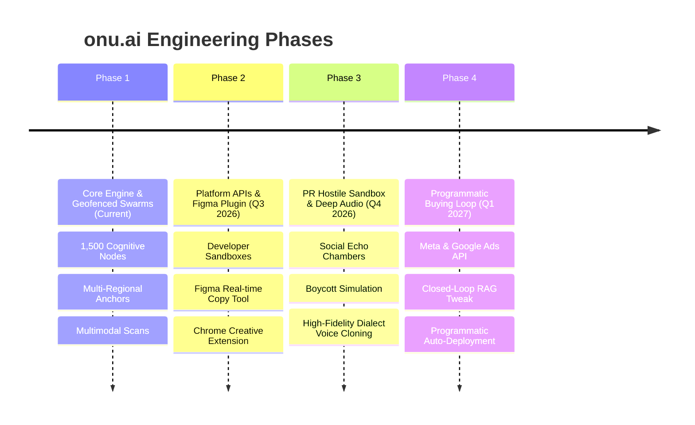

# onu.ai — Product & Technology Roadmap

This technical roadmap outlines the past milestones, current operational baseline, and future engineering milestones for the **onu.ai** platform.

---

## 📅 Roadmap Overview

---

## 🛠️ Phase Details

### 🟢 Phase 1: Core Engine & Geofenced Swarms (Completed)
*   **Completed Milestones**:
    *   **1,500-Node Persona Orchestrator**: High-performance parallel simulation grid mapping target cohorts in under 2 seconds.
    *   **Geofenced Regional Anchors**: Dynamic coordinates and dialect matrices for Dhaka Metro, Narayanganj Hub, Gazipur Belt, Sylhet Remittance, Chittagong Port, and Bogura Gateways.
    *   **Multimodal AI Perception Grid**: Vision OCR banner scan, Acoustic Dialogue Optimizer, and Social Caption Analysis.
    *   **Actionable Directives Panel**: Checkbox-controlled interactive optimization loops that recalculate Friction, Data Confidence, and Projected ROAS Lift live.
    *   **Executive Swarm Consultation**: Real-time staggered chat with localized agent personas.

---

### 🔵 Phase 2: Platform APIs & Figma Plugin (Q3 2026)
*   **API Command Center**:
    *   Release full API developer keys enabling external software teams to trigger simulations programmatically via standard JSON payloads.
    *   Develop a Python SDK (`pip install onu-ai`) for performance marketing teams to write custom bulk simulation scripts.
*   **Figma Integration**:
    *   Build a lightweight Figma plugin that allows UI/UX copywriters to select text layers inside their designs, send them to the onu.ai engine, and immediately preview how localized personas react to layout copy.
*   **Chrome Extension**:
    *   An extension for Meta Ads Manager, allowing media buyers to test dynamic ads directly in their browser before confirming campaign budgets.

---

### 🟡 Phase 3: Adversarial Sandbox & Deep Dialect Audio (Q4 2026)
*   **Hostile Narrative Sandbox**:
    *   Simulate adversarial social media environments (comment sections, Reddit threads, viral Facebook cascades).
    *   Identify potential public relations risks, boycotted keywords, or unintended socio-political double entendres inside localized ad copy before public deployment.
*   **High-Fidelity Audio Dialect Cloning**:
    *   Integrate direct voice-synthesis layers. If the Audio Dialogue Optimizer suggests a copy edit (e.g. changing premium standard Bengali to Narayanganj merchant slang), it automatically re-synthesizes the voice track using highly natural regional voice profiles.

---

### 🔴 Phase 4: Programmatic Auto-Buying Loop (Q1 2027)
*   **Meta & Google Ads Integration**:
    *   Connect onu.ai's optimization directives directly to live Meta and Google ad accounts.
*   **Closed-Loop Autonomous Optimizations**:
    *   When the system detects a drop in live conversion rates (ROAS), it automatically calls the Brand Vault RAG model.
    *   The engine rewrites the copy, changes the bKash cashback incentives to match current regional demand indices, tests the new variant against the 1,500-node cohort, verifies a high safety score, and replaces the underperforming ad asset in production—**entirely without human intervention**.
